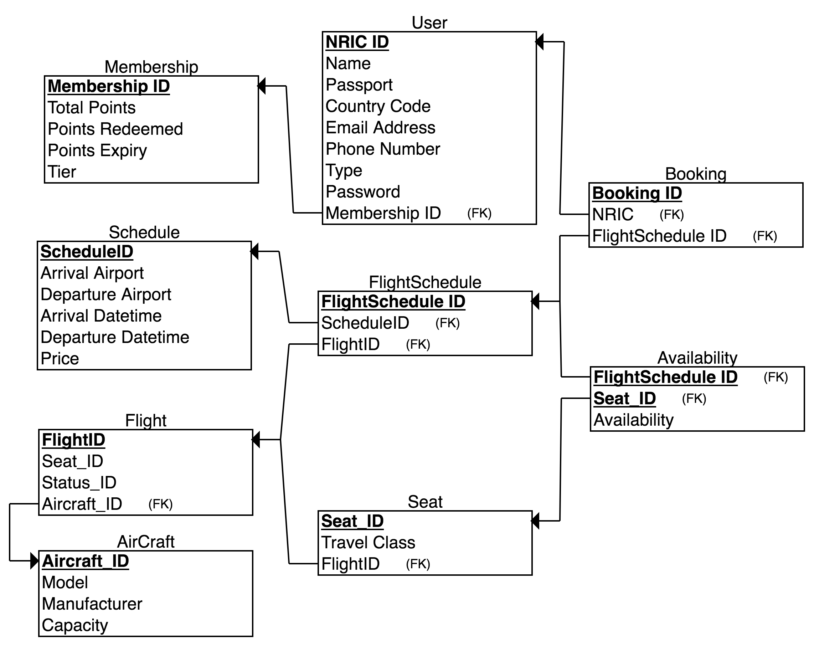

## Installation Instruction

1) Download mysql software [Link](https://dev.mysql.com/downloads/mysql/5.1.html#macosx-dmg)

By then, your computer will already be running the mysql software in the background.

2) Download the GUI of mysql workbench [Link](https://dev.mysql.com/downloads/workbench/)

Launch mysql workbench and connect to your mysql in the background. Create a test schema, a simple user table with ID and also insert the user table with 1 toy example.

3) Install node.js and npm [Link](https://www.npmjs.com/get-npm)

Node.js is a runtime environment for javascript and npm is the package manager to install all relevant dependencies

For more visual guide, visit this [link](https://www.youtube.com/watch?v=xn9ef5pod18)

## Setting up of Database

Access the main `etl.ipynb` from `setup` folder.

Requirements:
- jupyter notebook
- pandas
- pip installation

Open `etl.ipynb` and run all the cells and viola you will have 1000 records of dummy data appearing in all the tables. 

